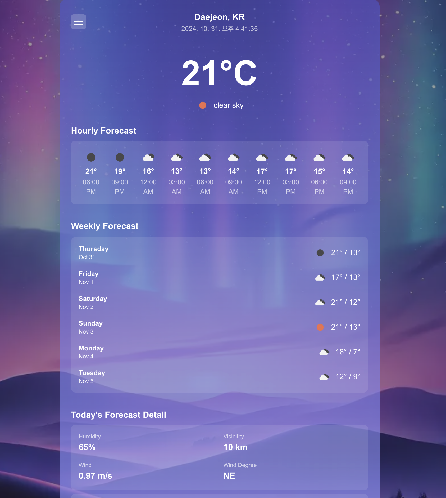
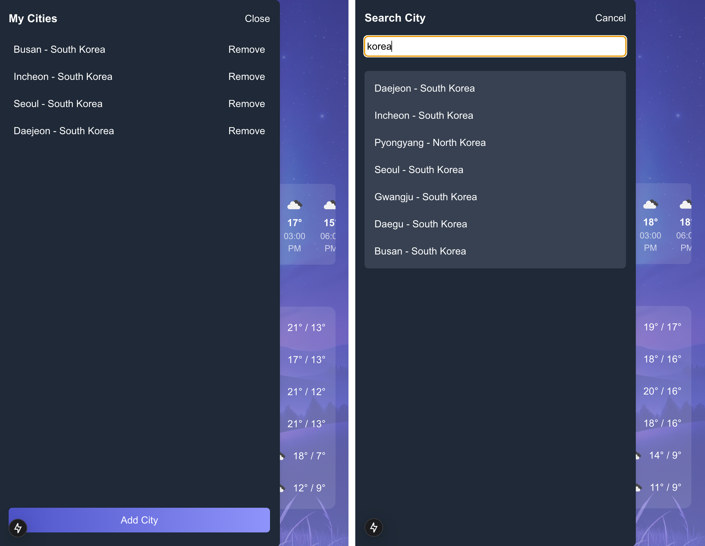

# Weather Web Frontend



## Project Overview

Weather Web Frontend is a web application that allows users to view the current and weekly weather forecast for any
selected city. Built using the OpenWeatherMap API, this app provides real-time weather information and allows users to
save and manage multiple cities for easy access.

---

## Getting Started

### 1. Clone the Repository and Install Dependencies

```bash
# Clone the repository
git clone https://github.com/asj8000/weather-web-frontend.git
cd weather-web-frontend

# Install dependencies
npm install
```

### 2. Set Up Environment Variables

You will need an API key from OpenWeatherMap. Create a .env.local file in the root directory and add your API key as
follows:

```bash
NEXT_PUBLIC_OPENWEATHERMAP_API_KEY=YOUR_API_KEY_HERE
```

### 3. Run the Development Server

```bash
npm run dev
```

Open http://localhost:3000 in your browser to see the app in action.

## Demo Screenshots




## Background Image

The background image was generated using OpenAI’s GPT-4 model. Ty GPT :)

## Development Time

According to WakaTime, this project took approximately **5 hours and 43 minutes** to develop.

## License

This project is licensed under the MIT License.

## Tech Stack

- **Framework**: Next.js
- **Styling**: Tailwind CSS
- **Weather Data API**: OpenWeatherMap API
- **State Management**: React Hooks

---

Feel free to reach out if you have any questions. Happy coding! 🚀
